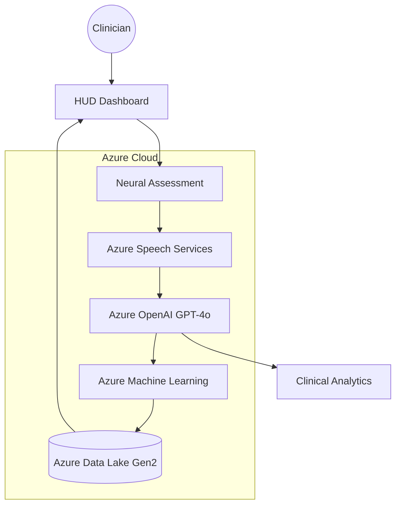

---

# 🧠 NeuroTrack X

### **Next-Gen Clinical Workstation for Early Cognitive Risk Detection**

*Built for the Microsoft Imagine Cup*

[](https://azure.microsoft.com/en-us/services/cognitive-services/openai-service/)
[](https://azure.microsoft.com/en-us/services/machine-learning/)
[](https://azure.microsoft.com/en-us/services/cognitive-services/speech-services/)
[](https://neurotrackx-ahhyd7hfbrerd5cu.southeastasia-01.azurewebsites.net/)
[](https://opensource.org/licenses/MIT)

---

## 🔗 Live Demo & Repository

- **🚀 Live Deployment:** [Click here to launch NeuroTrack X](https://neurotrackx-ahhyd7hfbrerd5cu.southeastasia-01.azurewebsites.net/)
- **💻 GitHub Repository:** [github.com/ManyaValecha/NeuroTrack](https://github.com/ManyaValecha/NeuroTrack)

---

## 🌟 Vision

Cognitive decline develops gradually, yet most diagnoses occur only after irreversible damage. Traditional screening methods are episodic, invasive, and difficult to scale.

**NeuroTrack X** leverages **Microsoft Azure AI** to detect early cognitive risk through **speech-based biomarkers**, enabling proactive, continuous, and non-invasive screening. By analyzing subtle changes in language, acoustics, and prosody, NeuroTrack X supports earlier clinical intervention and long-term patient monitoring.

---

## 🚀 Key Features

### 💎 Clinical-Grade UI/UX

NeuroTrack X is designed as a modern **Clinical Heads-Up Display (HUD)** optimized for neurologists, psychiatrists, and researchers:

* **Neural Visualizer**: Real-time audio frequency visualization using HTML5 Canvas
* **Live Neural Stream**: Dynamic background simulating continuous patient telemetry
* **Motion Orchestration**: Smooth page transitions and micro-interactions using Framer Motion
* **AI Assistant**: Integrated Floating Chatbot powered by **Azure OpenAI** & **Google Gemini** for instant clinical support.

---

### 🤖 Azure-Native Intelligence

The platform is built end-to-end on **Microsoft Azure**, ensuring scalability, reliability, and enterprise-grade security:

* **Azure OpenAI (GPT-4o)**: Extracts linguistic and semantic biomarkers from speech
* **Azure Speech SDK**: Neural-quality transcription and acoustic feature analysis
* **Azure Machine Learning**: Real-time cognitive risk classification via managed endpoints
* **Azure Data Lake Gen2**: Secure storage for longitudinal patient data
* **Azure App Service**: High-performance hosting for the clinical dashboard

---

## 🏗️ System Architecture



---

## 🛠️ Technical Stack

* **Framework**: React 19 + Vite
* **Styling**: TailwindCSS 4.0 (Glassmorphism, Neon Clinical Theme)
* **Animation**: Framer Motion
* **Charts**: Recharts
* **State Management**: React Context API
* **AI Services**: Azure OpenAI, Azure Speech, Azure Machine Learning, Google Gemini
* **Storage**: Azure Data Lake Gen2
* **Deployment**: Azure App Service (CI/CD via GitHub Actions)

---

## 💼 Business Model

### 🏥 B2B SaaS for Healthcare Providers

NeuroTrack X is offered as a **subscription-based SaaS platform** to hospitals, clinics, and telehealth providers.

* Pricing based on clinician seats or patient volume
* Enterprise plans for hospital networks and research institutions
* Enables scalable cognitive screening with minimal operational overhead

---

### 🧪 Licensing for Research & Pharma

* Licensing anonymized, aggregated speech biomarkers
* Cognitive monitoring for clinical trials
* Longitudinal digital endpoints for neurodegenerative research

---

### 🏛️ Public Health & Institutional Partnerships

* Population-level cognitive screening programs
* Government and NGO healthcare initiatives
* Remote access for underserved and aging populations

---

## 💻 Getting Started

### Prerequisites

* Node.js v20+
* Azure subscription with:
  * Azure OpenAI
  * Azure Speech Services
  * Azure Machine Learning

### Installation

1. **Clone the repository**

   ```bash
   git clone https://github.com/ManyaValecha/NeuroTrack.git
   cd NeuroTrack
   ```

2. **Configure environment variables**
   Create a `.env` file in the root directory (see `.env.example`):

   ```bash
   VITE_AZURE_OPENAI_KEY=your_key
   VITE_AZURE_OPENAI_ENDPOINT=your_endpoint
   VITE_AZURE_OPENAI_DEPLOYMENT=gpt-4o

   VITE_AZURE_SPEECH_KEY=your_key
   VITE_AZURE_SPEECH_REGION=your_region
   
   VITE_GEMINI_API_KEY=your_gemini_key
   ```

3. **Install dependencies and run**

   ```bash
   npm install
   npm run dev
   ```

---

## 🛤️ Future Roadmap

* Multimodal analysis (speech + facial micro-expressions)
* Federated learning across clinical institutions
* Mobile clinician companion for real-time alerts
* Regulatory readiness (HIPAA, GDPR alignment)

---

## 📜 License

MIT License © 2026 NeuroTrack X

---

*Proudly developed for the **Microsoft Imagine Cup**.
Advancing early detection through responsible, scalable AI.*
